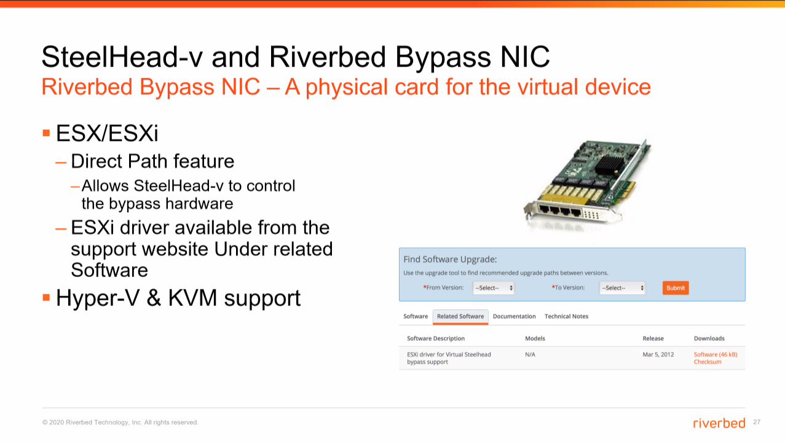

# SteelHead-V and Riverbed Bypass NIC

Riverbed Bypass NIC-A physical card for the virtual device.

#### ESX/ESXI

- Direct Path feature
- Allows SteelHead-v to contral the bypass hardware:
- ESXI driver available from the support website Under related Software
- Hyper-V & KVM support

