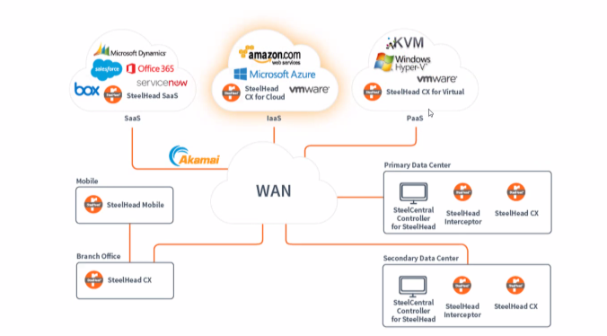

# Deployment Methods

## Deployment Methods: Physical In-Path

- LAN & WAN Connected
- We will look into more detail on:
- Serial clusters Parallel clusters
- Simplified Routing
- Failover Scenarios

## Deployment Methods: Virtual In-Path

- WAN physically connected: in-paths interfaces used for optimization
- We will look into more detail on:
- Policy-based Routing
- WCCP
- Interceptor
- Layer-4 Switch

## Deployment Methods: Cloud Optimization Cloud Computing

#### Private cloud

- Resources match demand, but can be slow or expensive to adapt Management of resources without restrictions
- Security Compliance
- High Availability, but at a cost

#### Public cloud

- Scalable and agile
- Consumer-based billing
- High Availability

#### Hybrid cloud

- As the name implies.

## Deployment Methods & Network Asymmetry

- Network Asymmetry Affects Optimization
- Asymmetric Routing (AR) can be disruptive in optimized environments!
- SteelHeads need two-way traffic to optimize, regardless of topology:
- In-path
- virtual in-path

> Virtual in-path can also be a solution, more later

- As a result the initial connection will take longer, or even fail SteelHeads will pass through all IP pairs for 24 hours when AR detected. This is to avoid reoccurring fallures
- The table can be flushed manually, but must be done on all affected SteelHeads
- Consider manual reset or an auto-kickoff rule

> *Remember **nothing** happens until we see a **SYN message**.*
