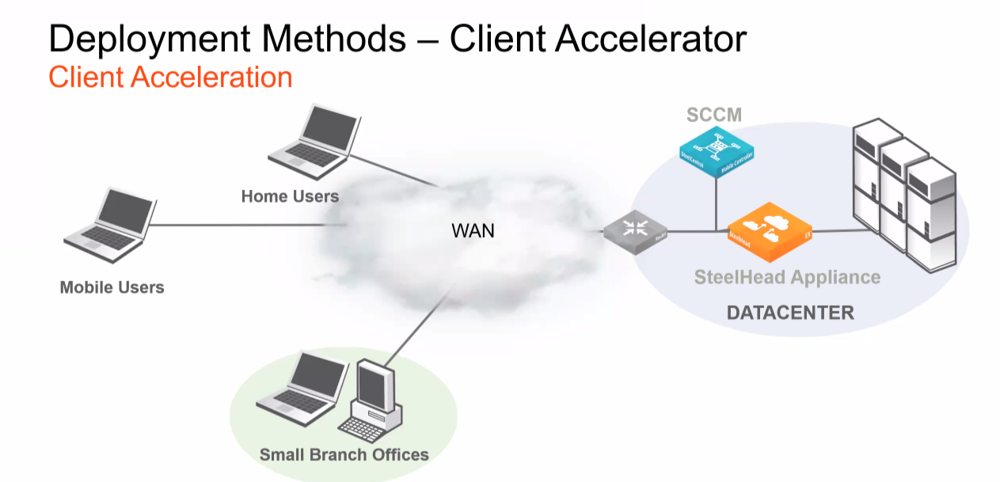

# Quick Notes

- License Tiers


## SteelHead-V Best Practices for Performance

- Do not share NICS and use at least 1Gbps

- Allow resources Hypervisor overhead

- Do not over provision CPU Use a Server Grade CPU for the Hypervisor

- Always reserve RAM & Virtual RAM < Physical RAM

- Use SSDs or other high speed disk for the Segstore - Do not share physical disks between hosts

- Do not use hyperthreading

- Apply BIOS power settings for maximum performance

## Steel Head-v and Riverbed Bypass NIC

Riverbed Bypass NIC-A physical card for the virtual device.

- **ESX/ESXI**

  - Direct Path feature

  - Allows SteelHead-v to contral the bypass hardware:

  - ESXI driver available from the support website Under related Software

- **Hyper-V & KVM support**

## Deployment Methods: Physical In-Path

- LAN & WAN Connected

- We will look into more detail on:

  - Serial clusters Parallel clusters

  - Simplified Routing

  - Failover Scenarios


## Deployment Methods: Virtual In-Path

- WAN physically connected - in-paths interfaces used for optimization
-
- We will look into more detail on:

  - Policy-based Routing

  - WCCP

  - Interceptor

  - Layer-4 Switch



## Deployment Methods - Cloud Optimization Cloud Computing

- **Private cloud:**

  - Resources match demand, but can be slow or expensive to adapt Management of resources without restrictions

  - Security Compliance

  - High Availability, but at a cost

- **Public cloud:**

  - Scalable and agile

  - Consumer-based billing

  - High Availability

- **Hybrid cloud:**

  - As the name implies.

## Deployment Methods & Network Asymmetry

- Network Asymmetry Affects Optimization

- Asymmetric Routing (AR) can be disruptive in optimized environments!

- SteelHeads need two-way traffic to optimize, regardless of topology:

- In-path or virtual in-path

- Virtual in-path can also be a solution, more later

- As a result:

  - The initial connection will take longer, or even fail SteelHeads will pass through all IP pairs for 24 hours when AR detected. This is to avoid reoccurring fallures

  -The table can be flushed manually, but must be done on all affected SteelHeads

> Remember NOTHING happens until we see a SYN message to start optimization Consider manual reset or an auto-kickoff rule

## Enhanced Auto Discovery (EAD) - Overview Why Use Enhanced?

- Default since RIOS version 5.5.4

- Used to find the LAST Steel Head, not the first

- Useful on double WAN hops

  - Also useful in serial deployments, but peering rules are much better

  - Faster to fail when the server is not available

  - Faster to detect network asymmetry

- **Why not?**

  - May need to be disabled in certain SaaS backhaul deployments, or when overcoming egregious WAN latency such as double satellite

## Wireshark PCAP of EAD traffic

```log
Options: (28 bytes), Maximum segment size, No-Operation (NOP)
Maximum segment size: 1460 bytes
No-Operation (NOP) Window scale: 8 (multiply by 256)
No-Operation (NOP),
No-Operation (NOP)
TCP SACK Permitted Option: Truel
Riverbed Probe: Probe Query, CSH IP: 10.1.120.21
    Length: 10
    Kind: Riverbed Probe (76)
    Length: 10
    0000... Type: 0
    .... 0001 Version: 1
    Reserved: 0x01
    CSH IP: 10.1.120.21 Application Version: 5
Riverbed Probe: Probe Query Info Length: 4
    Kind: Riverbed Probe (76) Length: 4
    0000 110. Type: 6
    .......8 Version: 2
  Probe Flags: 0x21
No-Operation (NOP) End of Option List (EOL)
```

## Transparency Options Field

> Carried in EVERY packet, after SYN and SYN/ACK

- Configured on in-path rules: Can be with Fixed Target (on cli and in-path only)

- Filter on Wireshark: tcp.options.rvbd.trpy

- 4e labels packets as "WAN side Optimized" for use by:

  - SteelHeads

  - Interceptors

  - SteelCentral devices

  - Contains pseudo Src/Dest IP and ports

  - Effectively NAT/PAT on egress of SH

## Why use different modes?

- Honestly, in most circumstances, correct addressing is fine however it does depend on the Steel Head deployment method.

- In SD-WAN environments, full transparency is required so that the SD-WAN policy in place to use a different bearer based on the application or any 5 tuples.

**Disadvantages of transparency**

- You lose a feature called Connection pooling, where 20 TCP connections are pre-established between every peer. This skips the need for a 3-way handshake when a session over the WAN is initiated.****
