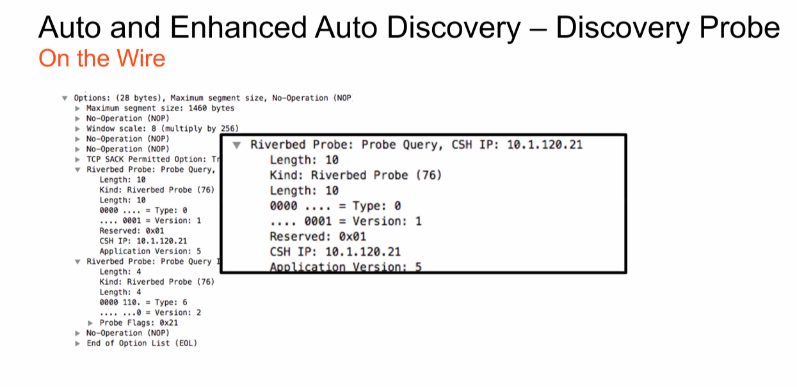

# Quick Notes

## SteelHead-V Best Practices

- **Dont's** ❌
  - Do not share NICS and use at least 1Gbps
  - Do not use hyperthreading
  - Do not share physical disks between hosts
  - Do not over provision CPU Use a Server Grade CPU for the Hypervisor
<br>
- **Do's:** ✅
  - Allow resources Hypervisor overhead
  - Always reserve Virtual RAM / Physical RAM
  - Use SSDs or other high speed disk for the Segstore
  - Apply BIOS power settings for maximum performance

---

## Steel Head-v and Riverbed Bypass NIC

Riverbed Bypass NIC-A physical card for the virtual device.

- **ESX/ESXI**
  - Direct Path feature
  - Allows SteelHead-v to contral the bypass hardware:
  - ESXI driver available from the support website Under related Software
- **Hyper-V & KVM support**


---

## Deployment Methods: Physical In-Path

- LAN & WAN Connected
- We will look into more detail on:
  - Serial clusters Parallel clusters
  - Simplified Routing
  - Failover Scenarios


---

## Deployment Methods: Virtual In-Path

- WAN physically connected - in-paths interfaces used for optimization
- We will look into more detail on:
  - Policy-based Routing
  - WCCP
  - Interceptor
  - Layer-4 Switch


---

## Deployment Methods - Cloud Optimization Cloud Computing

- **Private cloud:**
  - Resources match demand, but can be slow or expensive to adapt Management of resources without restrictions
  - Security Compliance
  - High Availability, but at a cost
- **Public cloud:**
  - Scalable and agile
  - Consumer-based billing
  - High Availability
- **Hybrid cloud:**
  - As the name implies.


---

## Deployment Methods & Network Asymmetry

- Network Asymmetry Affects Optimization
- Asymmetric Routing (AR) can be disruptive in optimized environments!
- SteelHeads need two-way traffic to optimize, regardless of topology:
  - In-path
  - virtual in-path

> Virtual in-path can also be a solution, more later


- As a result the initial connection will take longer, or even fail SteelHeads will pass through all IP pairs for 24 hours when AR detected. This is to avoid reoccurring fallures
- The table can be flushed manually, but must be done on all affected SteelHeads
- Consider manual reset or an auto-kickoff rule

> *Remember **nothing** happens until we see a **SYN message**.*

---

## Enhanced Auto Discovery (EAD)

- **Why Use EAD?**

  - Default since RIOS version 5.5.4
  - Used to find the LAST Steel Head, not the first
  - Useful on double WAN hops
    - Also useful in serial deployments, but peering rules are much better
    - Faster to fail when the server is not available
    - Faster to detect network asymmetry



- **Why Not Use EAD?**

  - May need to be disabled in certain SaaS backhaul deployments, or when overcoming egregious WAN latency such as double satellite


---

## Wireshark PCAP of EAD traffic

```log
Options: (28 bytes), Maximum segment size, No-Operation (NOP)
Maximum segment size: 1460 bytes
No-Operation (NOP) Window scale: 8 (multiply by 256)
No-Operation (NOP),
No-Operation (NOP)
TCP SACK Permitted Option: Truel
Riverbed Probe: Probe Query, CSH IP: 10.1.120.21
    Length: 10
    Kind: Riverbed Probe (76)
    Length: 10
    0000... Type: 0
    .... 0001 Version: 1
    Reserved: 0x01
    CSH IP: 10.1.120.21 Application Version: 5
Riverbed Probe: Probe Query Info Length: 4
    Kind: Riverbed Probe (76) Length: 4
    0000 110. Type: 6
    .......8 Version: 2
  Probe Flags: 0x21
No-Operation (NOP) End of Option List (EOL)
```


---

## Transparency Options Field

> Carried in EVERY packet, after SYN and SYN/ACK

- Configured on in-path rules: Can be with Fixed Target (on cli and in-path only)
- Filter on Wireshark: tcp.options.rvbd.trpy
- 4e labels packets as "WAN side Optimized" for use by:
  - SteelHeads
  - Interceptors
  - SteelCentral devices
  - Contains pseudo Src/Dest IP and ports
  - Effectively NAT/PAT on egress of steelhead


---

## Why use different modes?

- Honestly, in most circumstances, correct addressing is fine however it does depend on the Steel Head deployment method.
- In SD-WAN environments, full transparency is required so that the SD-WAN policy in place to use a different bearer based on the application or any 5 tuples.
- Disadvantages of transparency:
  - You lose a feature called Connection pooling, where 20 TCP connections are pre-established between every peer. This skips the need for a 3-way handshake when a session over the WAN is initiated.****

---

## Management and Configuration (Mgmt & Config)

> Management is available on all interfaces by default

- Rest API for special purposes such as automation
- Graphical User Interface via HTTP / HTTPS
- MIB downloadable from the GUI
- Telnet *(disabled by default)*
- Rest API
- SNMP
- SSH
- BMC

> Best Practice: Always use the SCC.

- **CLI Command Entry Modes**
  - User
  - Enable
  - Config

---

## Riverbed SteelHead Show Interface

```sh
VCX255-A #sh int inpath0_0
Interface: inpath0 0
State: Up
Interface type: ethernet
IP address: 10.1.30.125
Netmask: 255.255.255.0
IPv6 link-local address: fe80::20c:29ff: fe28:b93d/64
MTU: 1500
HW address: 00:0C:29:28:B9:3D
Traffic status: Normal
HW blockable: no
Counters cleared date: 2019/12/12 11:43:00
RX bytes: 6526710
RX mcast packets: 51827
errors: 0
RX overruns: 100
TX bytes: 1548
```

---

## Riverbed SteelHead configuration wizard

```sh
VCX255-A (config) conf jump-start
Step 1: Hostname? (VCX255-A1)
Step 2: Use DHCP on primary interface? [no]
Step 3: Primary IP address? [10.1.30.25)
Step 4: Netmask? [255.255.255.0]
Step 5: Default gateway? [10.1.30.254]
Step 6: Primary DNS server? (10.1.30.102)
Step 7: Domain name? [training.local]
Step 8: Admin password?
Step 9: SMTP server?
Step 10: Notification email address?
Step 11: Set the primary interface speed? [auto]
Step 12: Set the primary interface duplex? [auto]
Step 13: Would you like to activate the in-path configuration? [yes]
Step 14: In-Path IP address? (10.1.30.125)
Step 15: In-Path Netmask? 1255.255.255.01
Step 16: In-Path Default gateway? [10.1.30.254)
Step 17: Set the in-path:LAN interface aspeed? [auto]
Step 18: Set the In-path: LAN interface duplex? [auto]
Step 19: Set the in-path:WAN interface speed? [auto]
Step 20: Set the in-path: WAN Interface duplex? [auto]
```

---

## Network interface configuration

```ini
interface aux description
interface aux dhcp
interface aux dhcp dynamic-dns
no interface aux dhcpv6
no interface aux shutdown
interface aux dhcpv6 dynamic-dns
interface aux mtu "1588"
interface aux speed "auto"
interface inpath8 8 description "" no interface inpath8_8 dhcp
no interface inpath8 8 dhcp dynamic-dns na interface inpath8_8 dhcpv6
no interface inpath8 8 dhcpv6 dynamic-dns
no interface interface
inpath0 8 force-Mdi-x enable inpath8_8 ip address 18.1.58.125 /24
interface inpath8 8 mtu "1588"
interface interface
inpath8_8 napi-weight "128" inpath8_8 shutdown
interface inpath8_8 speed "auto"
no interface shutdown
inpathB 8 txqueuelen "188" lo description
```

---

## Housekeeping - Licensing Structure

- Licenses are small strings of text tied to the HW
  - Example: LK1-SH40SSL-0000-0000-5-8B40-0361-F11D
- Basic Licenses plus options and sizing can be added by:
  - CLI
  - GUI
  - Call Home function

---

## Housekeeping - Export Flow Statistics

- NetFlow and other Flow Data Collectors gather network statistics about network hosts, protocols and ports, peak usage times, traffic paths, and others
- The flow data collectors update flow records with information pertaining to each packet traversing a specified network interface

---

## Housekeeping - Flow Data Component Basics

- Exporter - A device that sees the data flows going through the network, such as a SteelHead or a router
- Collector - A server or appliance designed to aggregate data sent to it by NetFlow Exporter, such as Steel Central Flow Gateway
- Analyzer - A collection of tools (usually provided in conjunction with a collector) used to analyze the data and provide relevant data summaries and graphs, such as SteelCentral NetProfiler

---

## Housekeeping - Configuration Management

- The Configuration is held in binary format
- Pasting a text file to the CLI is NOT recommended
- Configuration files are backed up locally with a .bak copy and can be uploaded manually to a server - Files are also regularly backed up to the SCC
- Files can be saved locally before every change
- Creates an easy rollback if required in a service window

---

## Authentication

The following user authentication methods are available for administrative and monitoring purposes:

🔒 Local
🔒 SAML
🔒 RADIUS
🔒 TACACS+

Custom Shell profiles and AV pairs are required for SteelHeads This is covered by many knowledgebase articles.

- Admin Account: Administrator privileges
- Monitor Account: Read only access
- Gist is available for Cisco ACS environments in article 516158
- Typically local site admins don't need RW access as everything **Should be managed via an SCC**.

> If you make changes locally and don't reflect them on the SCC, they'll be wiped next time there is a push.
