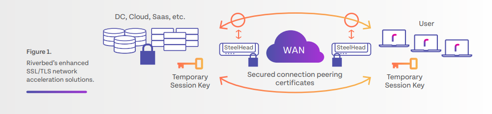

# Accelerate SSL/TLS Traffic

### Accelerate Encrypted SSL/TLS Traffic Across Complex Defence Network Environments

---

In the past, to optimize and accelerate encrypted traffic and applications involved lengthysecurity conversations, logistical hurdles, sharing orcopying hundreds of certificates and keys, perceived network security risks, and in the end, was often deemed too risky and difficult a process for agencies.Until NowAs encrypted traffic started overtaking public sector networks, Riverbed began reengineering itsoptimization and acceleration solutions to meet thenew norm of SSL/TLS encryption.

Riverbed’s enhanced SteelHead WAN Optimization and Client Accelerator solutions simplify the authentication process of SSL/TLS traffic. Client Accelerator now functions like a Hardware Security Module (HSM) by granting access to the “session” key, which is unique and randomly generated, for each encrypted communication session.

This novel approach to authentication bypassesthe traditional SSL/TLS “handshake” that requirespublic and private keys and certificates and instead allows encrypted network communications between authorized users and applications within the SteelHead optimization fabric.

No sensitive keys orcredentials are ever exchanged or exposed. Once a SSL/TLS session is authenticated and an encrypted connection is established, Defence agencies can easily easily unlock network capacity and improve application performance to meet the ever-growing demands of global users.

### Breakthrough Performance and Speed for Defense Encrypted Apps and Traffic

| Benefits of SSL/TLS Acceleration |
|-------------------------------------------------------------|
| Maintain and strengthen network security postures |
| Achieve zero-touch SSL/TLS optimization and acceleration |
| Unlock critical capacity across any Defense network environment |
| Realize true value of IT investments |
| Transparently operate with mutual authentication (CAC) and advanced TLS (ECDH, PFS) |
| Eliminate certificate management |
| Reduce bandwidth requirements by up to 99% |
| Boost the performance of any on-prem or SaaS SSL/TLS applications by up to 10x |

### Challenges

One of the Department of Defense’s Uniformed Services Branches (USB) operates in bandwidth-challenged remote locations across the world where a “Logistics” application, among other mission-critical applications, had been rendered inaccessible due to extreme latency on the Command’s satellite network. Without this application, service technicians could not procure crucial parts needed to repair military assets, resulting in these assets being taken offline and exposing a significant operational vulnerability. Like other Defense agencies, the USB had previously been reluctant to optimize and accelerate its SSL/TLS traffic due to perceived network security concerns.

### Solution

The USB had previously been working with Riverbed to optimize and accelerate its non-encrypted traffic. When evaluating and testing the SSL/TLS-enhanced SteelHead WAN Optimization and Client Accelerator solutions, the USB was easily able to configure and deploy, identify the SSL/TLS application for acceleration, authenticate with the application’s “session” key, and establish encrypted network session. Then the USB employed traditional optimization and acceleration approaches that significantly reduced latency and unlocked network capacity, all while maintaining an encrypted environment.

### Benefits

With Riverbed’s enhanced SteelHead WAN Optimization and Client Accelerator, the USB was able to optimize and accelerate the SSL/TLS traffic unlocking nearly 3x satellite bandwidth capacity. More importantly, the USB was able to bring its mission-critical logistics application online, secure the parts and supplies needed to repair military assets, and support warfighters in the field.
