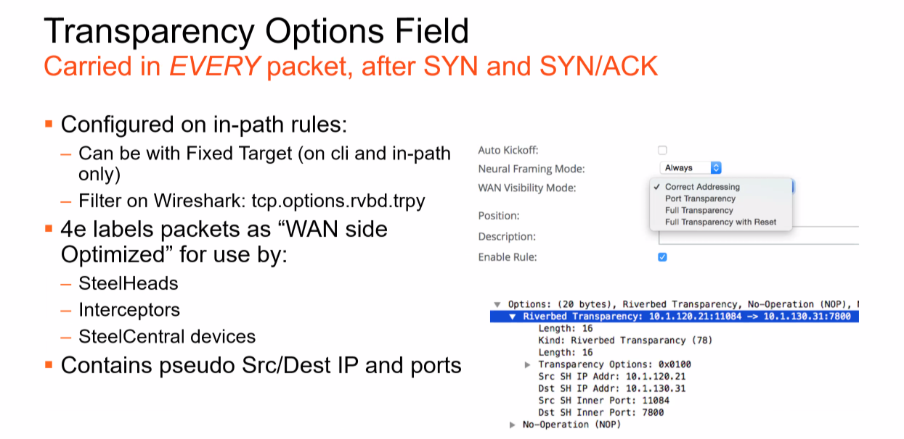

# Transparency Options Field

> Carried in EVERY packet, after SYN and SYN/ACK

- Configured on in-path rules: Can be with Fixed Target (on cli and in-path only)
- Filter on Wireshark: tcp.options.rvbd.trpy
- 4e labels packets as "WAN side Optimized" for use by:
  - SteelHeads
  - Interceptors
  - SteelCentral devices
  - Contains pseudo Src/Dest IP and ports
  - Effectively NAT/PAT on egress of steelhead

## Why use different modes?

- Honestly, in most circumstances, correct addressing is fine however it does depend on the Steel Head deployment method.
- In SD-WAN environments, full transparency is required so that the SD-WAN policy in place to use a different bearer based on the application or any 5 tuples.
- Disadvantages of transparency:
  - You lose a feature called Connection pooling, where 20 TCP connections are pre-established between every peer. This skips the need for a 3-way handshake when a session over the WAN is initiated.****
