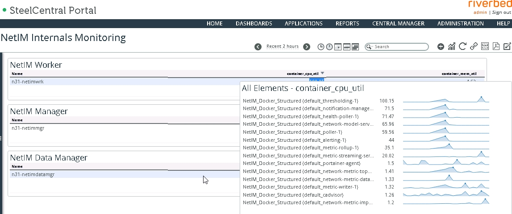

# NetIM GMC - Lightweight Self-Docker Monitoring

## Description

In [NetIM](https://www.riverbed.com/products/npm/netim.html), under the hood the Core, Manager and Worker nodes are running Docker which can be monitored by NetIM itself and also rendered in a Dashboard using [Portal](https://www.riverbed.com/products/npm/portal)

Here is an example of a dashboard using [Portal](https://www.riverbed.com/products/npm/portal)




## Preparation

The [MIB](mib) defines the User Defined Metrics in NetIM and needs to be imported to start collecting metrics for each node. Also each node has to be added as a monitored device in the NetIM Device Manager.

## Script Examples

The script examples that collect the metrics and feed NetIM can be deployed on any linux box having python3 and paramiko library installed. It can be one of the NetIM node,
thus we recommend to use another machine. For that you can follow the step by step installation of the [Metrics Collector Linux Robot](https://github.com/riverbed/Riverbed-Community-Toolkit/tree/master/NetIM/Synthetic-Test/Robot-002-MetricsCollector-Linux).

In the scripts examples, we propose 2 approaches for the metric ingestion:
- (recommended): REST API
- (legacy) MTR file based 

### Script example with REST API approach: ```scripts_metrics_api``` folder

1. The code is an example from a working setup which captures docker stats fot two NetIM instances DAL and CHE.
1. Both NetIMs have disparate number of worker VMs (keep that in mind when adapting the code).

### Script example with mtr file based approach: ```scripts_mtr``` folder

1. Add your NetIM nodes into the NetIM inventory keeping in mind the names you assign to the devces in ```n31-netimrvbdlab.json```
```curl --insecure --user admin:admin -H 'Content-Type: application/json' -d @n31-netimrvbdlab.json https://10.99.31.75:8543/api/netim/v1/devices```
1. Verify that the NetIM nodes have made it into NetIM inventory.
1. Copy the ```gmc.sh```, ```copy-mtr-files.py``` and ```netim-docker-gmc.py``` to the machine where you intend to run the script.
1. Create a folder called ```input``` and update the location of that folder in file ```netim-docker-gmc.py``` and ```copy-mtr-files.py```
1. Make sure to put the details of only the docker nodes into ```NETIM_DOCKER_NODES``` inside ```netim-docker-gmc.py```
1. Make sure to put the details for the core node into ```NETIM_CORE``` inside ```netim-docker-gmc.py```
1. Ensure the paths everywhere in all files are correct for your NetIM instance
