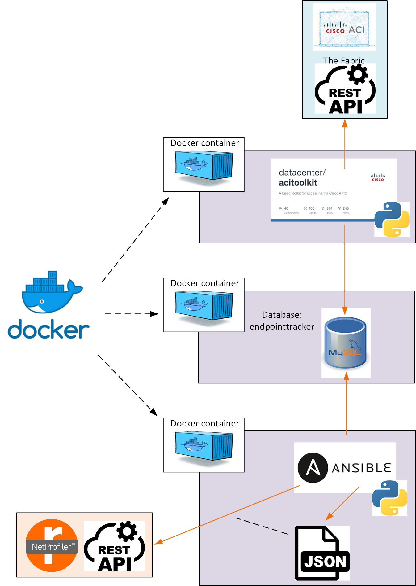

# Netprofiler Cisco ACI integration
The following cookbook contains a description of a workflow on how to add **Netprofiler** Hostgroups based on the endpoints connected to **Cisco ACI**.

## Workflow overview



## Workflow description
The above workflow consists of the following parts:  
1. Docker container which runs the [Cisco ACI toolkit](https://developer.cisco.com/codeexchange/github/repo/datacenter/acitoolkit). 
2. Docker container which runs [MySQL](https://www.mysql.com) server.
2. Docker container which runs [Ansible](https://www.ansible.com/)

The Cisco ACI toolkit contains a script [endpointtracker](https://acitoolkit.readthedocs.io/en/latest/endpointtracker.html) which extracts all the endpoints from an indicated Tenant into a MySQL table (endpoints) with the following structure:
```
MariaDB [endpointtracker]> desc endpoints;
+-----------+-----------+------+-----+---------------------+-------------------------------+
| Field     | Type      | Null | Key | Default             | Extra                         |
+-----------+-----------+------+-----+---------------------+-------------------------------+
| mac       | char(18)  | NO   |     | NULL                |                               |
| ip        | char(16)  | YES  |     | NULL                |                               |
| tenant    | char(100) | NO   |     | NULL                |                               |
| app       | char(100) | NO   |     | NULL                |                               |
| epg       | char(100) | NO   |     | NULL                |                               |
| interface | char(100) | NO   |     | NULL                |                               |
| timestart | timestamp | NO   |     | current_timestamp() | on update current_timestamp() |
| timestop  | timestamp | YES  |     | NULL                |                               |
+-----------+-----------+------+-----+---------------------+-------------------------------+
```

## Getting the endpoint information

Before starting the [docker-compose](docker-compose-final.yml) file the custom Ansible container needs to be build with the following [docker-file](dockerfile-ansible).
```
docker build -t m_ansible:netprofiler -f dockerfile-ansible .
```
Verify that the container image is existing:
```
docker images m_ansible:aci
```
Modify the docker-compose file environment variables APIC_URL, APIC_LOGIN and APIC_PASSWORD to the work environment values:
```
   environment:
      - APIC_URL=https://myapic.url
      - APIC_LOGIN=admin
      - APIC_PASSWORD=mysecret_password
```

Start the docker-compose file:
```
docker-compose -f docker-compose-final.yml up -d
```
Verify that all 3 containers are up and running:
```
docker ps -a                     
CONTAINER ID   IMAGE                    COMMAND                  CREATED          STATUS          PORTS                 NAMES
c44e76fe01c9   dockercisco/acitoolkit   "sleep infinity"         32 seconds ago   Up 31 seconds                         acitoolkit
008a14bc3c98   m_ansible:aci            "sleep infinity"         32 seconds ago   Up 31 seconds                         ansible
dc237249a07a   mysql:latest             "docker-entrypoint.s…"   32 seconds ago   Up 31 seconds   3306/tcp, 33060/tcp   mysql_db
```
Connect to the acitoolkit container and install the [mysql-connector](https://pypi.org/project/mysql-connector-python/) package for remote database connection and execute the python script that gets the endpoint information and writes it back to the MySQL database:
```
docker exec -ti acitoolkit /bin/bash
apt-get update && apt-get install -y python-pip && pip install mysql-connector-python==8.0.21
cd applications/endpointtracker/
python aci-endpoint-tracker.py
```
Verify that the database exists and is populated:
```
docker exec -ti m_ansible:aci /bin/bash
mysql -u root -ppassword -h 172.18.0.3 endpointtracker
select * from endpoints limit 10;
exit
exit
```
Modify the [create-hostgroups.yml](app/create-hostgroups.yml) file with the Netprofiler details:
```
  vars:
    host: "Netprofiler ipv4 address"
    access_code: "Oauth access code"
    tenant: "myTenant"
```
Run the ansible-playbook:
```
docker exec -ti m_ansible:aci /bin/bash
ansible-playbook -vvv create-hostgroups.yml
```


## Copyright (c) 2021 Riverbed Technology
